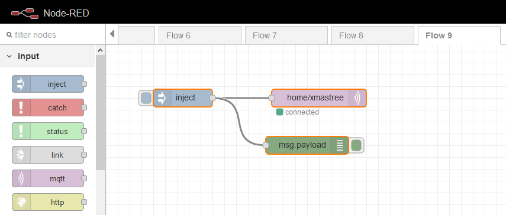

# Christmas Star vs .NET Core

A .NET Core controller for the [ModMyPi Programmable Christmas Tree Star](https://github.com/modmypi/Programmable-Christmas-Star)

## Background

A while ago, I submitted [this suggestion](https://github.com/dotnet/iot/issues/771) to the [dotnet/iot](https://github.com/dotnet/iot) repository on Github. My idea was too provide functionality that would allow a PC to remotely control the GPIO pins on a Raspberry Pi running the ['pigpiod' daemon](https://gpiozero.readthedocs.io/en/stable/remote_gpio.html). The suggestion was well received so I submitted [this PR](https://github.com/dotnet/iot/pull/875) providing an initial implementation. This garnered some excellent feedback which, unfortunately, I haven't yet had a chance to implement so the PR is still pending.

Then, a week or so ago, The Pi Hut put the [Raspberry Pi Christmas Tree Star](https://thepihut.com/products/raspberry-pi-christmas-tree-star) up for sale at ~£7. As most who know me know will tell you, I'm all for any opportunity to add tech to... well.... pretty much anything so, as we were about to go purchase our (locally and responsibly grown) Xmas tree, I thought this would be a fun play-thing.

This repository shows how the functionality I added to the dotnet/iot repository can be used to remotely control this star.

Feel free to play. I would very much welcome any additional patterns for the star or suggestions for improvements.

## Security

**A quick note on security**: When you [enable remote connections](https://gpiozero.readthedocs.io/en/stable/remote_gpio.html#enable-remote-connections) on the Pi, connections can be made to the Pi _**without any authentication at all**_. Therefore please only use this approach on a private network; an internet connected, compromised Raspberry Pi can provide quite a comprehensive entry point to your network!

## Solution

The solution is comprised of several projects:

### Star.Core

This project provides a `Star` class which connects to the 'pigpiod' daemon running on a Rasperry Pi Zero at a specific IP address and provides a `WriteAsync(uint frame)` method for controlling the LED's on the star. The `WriteAsync` method converts the specified 32-bit unsigned integer into a collection of 25 pin assignements via bitmasking as shown below:

|Bit|32|31|30|29|28|27|26|25|24|23|22|21|20|19|18|17|16|15|14|13|12|11|10|9 |8 |7 |6 |5 |4 |3 |2 |1 |
|---|--|--|--|--|--|--|--|--|--|--|--|--|--|--|--|--|--|--|--|--|--|--|--|--|--|--|--|--|--|--|--|--|
|BCM|nc|nc|nc|nc|nc|nc|nc|25|24|15|18|23|14|3 |4 |17|27|22|10|9 |11|5 |6 |13|19|26|16|20|21|12|7 |8 |

Such that a 32-bit value of '00000001010101010101010101010101' would result in every other LED on the Star being lit.

NOTE: As the Pigpio implementation isn't currently available in the [Iot.Device.Bindings](https://www.nuget.org/packages/Iot.Device.Bindings/) (due to the PR not being ready to merge) locally build assemblies have been included in the `.\lib` directory.

### Star.Marching.Console & Star.Twinkle.Console

These two projects run as a console application and show how to use the Star.Core library to display patterns on Star.

### Star.Mqtt.Console

#### Description

This project employs the [generic host](https://www.nuget.org/packages/Microsoft.Extensions.Hosting/) to reliably run a service from within a docker container. The service was designed to do two things:

1. Display frames received from an MQTT broker (as a 4 byte buffer) on the star.
2. Generate and display patterns on the star when no message has been received from MQTT for 10 seconds.

It can be configured by supplying the following environment variables:

**Star:Pi:Host** - The IP address of the Raspberry Pi broker running the 'pigpiod' daemon  
**Star:Pi:Port** - The Port to connect to the Raspberry Pi on (defaults to 8888)  
**Star:Mqtt:Broker** - The IP address of the MQTT broker to receive frames from  
**Star:Mqtt:Port** - The Port to connect to the MQTT broker on (defaults to 1883)  
**Star:Mqtt:Topic** - The Topic to receive frames from (defaults to 'home/xmastree')

#### Docker

A dockerfile is provides so that the Star.Mqtt.Console application can be run from with docker. It can be build by running the following command from the '$\src' directory (relative to repository root):

```
docker build -f .\Star.Mqtt.Console\Dockerfile -t star:latest .
```

And then run with the following command:

```
docker run -e Star:Pi:Host=[IPAddres of Pi] -e Star:Mqtt:Broker=[IP Address of Broker] star:latest
```

Alternatively a pre-build image can be pulled and run from [dockerhub](https://hub.docker.com/r/ibebbs/xmasstar) using the following:

```
docker run -e Star:Pi:Host=[IPAddres of Pi] -e Star:Mqtt:Broker=[IP Address] ibebbs/xmasstar:latest
```

#### Mqtt

To quickly test interaction with the Star I use the following Node-Red flow:



```json
[
    {
        "id": "475a2d52.bc7ebc",
        "type": "inject",
        "z": "16ce54a.befcb2b",
        "name": "",
        "topic": "",
        "payload": "[0,0,0,0]",
        "payloadType": "bin",
        "repeat": "",
        "crontab": "",
        "once": false,
        "onceDelay": 0.1,
        "x": 130,
        "y": 340,
        "wires": [
            [
                "3a547207.c894b6",
                "88005ec3.62baf"
            ]
        ]
    },
    {
        "id": "3a547207.c894b6",
        "type": "mqtt out",
        "z": "16ce54a.befcb2b",
        "name": "",
        "topic": "home/xmastree",
        "qos": "",
        "retain": "",
        "broker": "adea6257.de843",
        "x": 360,
        "y": 340,
        "wires": []
    },
    {
        "id": "88005ec3.62baf",
        "type": "debug",
        "z": "16ce54a.befcb2b",
        "name": "",
        "active": true,
        "tosidebar": true,
        "console": false,
        "tostatus": false,
        "complete": "payload",
        "targetType": "msg",
        "x": 340,
        "y": 420,
        "wires": []
    },
    {
        "id": "adea6257.de843",
        "type": "mqtt-broker",
        "z": "",
        "name": "Local",
        "broker": "192.168.1.24",
        "port": "1883",
        "clientid": "NodeRed",
        "usetls": false,
        "compatmode": true,
        "keepalive": "60",
        "cleansession": true,
        "birthTopic": "",
        "birthQos": "0",
        "birthPayload": "",
        "closeTopic": "",
        "closeQos": "0",
        "closePayload": "",
        "willTopic": "",
        "willQos": "0",
        "willPayload": ""
    }
]
```